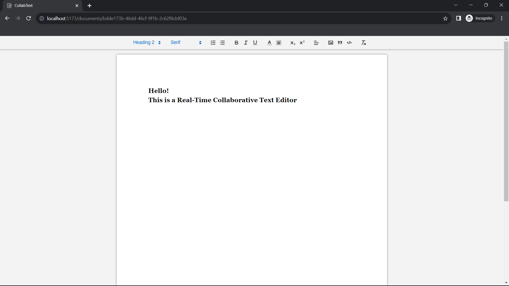

# CollabText - A Real-Time Collaborative Text Editor

This is a real-time text editor with support for conflict resolution in case of concurrent edits making it literally "collaborative".
The users can collaborate in real time while the issues related to overlapping edits are handled by the application. The changes made to the documents are persisted on reload.



# Etherpad: A real-time collaborative editor for the web


The frontend is built using [React](https://react.dev/) and [Quill.js](https://quilljs.com/) - a rich text editor library. The real-time behaviour is handled using [Socket.io](https://socket.io/) library at the backend, ensuring smooth synchronization.

To enable conflict resolution the [Operational Transform](https://en.wikipedia.org/wiki/Operational_transformation) technique is implemented which aims at resolving overlapping edits. The implementation is very much inspired by Tim Baumann's [implementation](https://github.com/Operational-Transformation/ot.js/) of the algorithm.
The Quill.js library stores its contents in a special format called Delta. It also provides a very good [API](https://github.com/quilljs/delta/#operational-transform) that helps in the implementation and integration of Operational Transform.

To maintain persistent storage for the documents, a MongoDB database is used which is connected to the server using the Mongoose ODM.

## Development setup

You need to have Node.js and npm installed to run this application.

Pull down the source code by forking the git repository and then cloning it. Then navigate to the project directory:

```sh
git clone https://github.com/<Your_Username>/Collaborative-Text-Editor.git
cd Collaborative-Text-Editor
```
Setup your environment variables like the PORT on which you would like the server to run and your MongoDB database URI.

To start the server, navigate to the `server` directory, install the dependencies and run the start command:

```sh
cd server
npm install
npm run dev
```

This will spin up a nodemon server. Now to start the frontend, navigate to `client` directory, install the dependencies and run the start command:

```sh
cd client
npm install
npm run dev
```

This will start the frontend on the Vite development server and will open a browser window to http://localhost:5173. 
Each time you hit this endpoint in a new tab, a new document will be created. 
